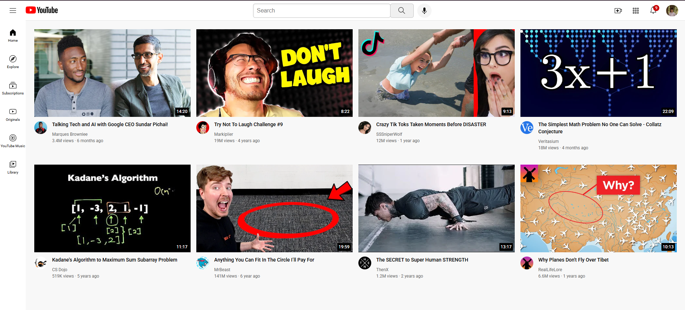

#  YouTube Clone

A responsive YouTube homepage clone built using **HTML5** and **CSS3**. This project was created to strengthen my understanding of modern CSS layout techniques including **Grid**, **Flexbox**, and **Positioning** while recreating a real-world user interface.

##  Live Demo

🔗 https://youtube-clone-nu-tan.vercel.app/

## 📸 Preview 



---

## ✨ Features

- Responsive video grid layout
- Modern YouTube-inspired UI
- Flexible layout using CSS Grid
- Navigation sidebar
- Search bar and header section
- Video thumbnails with channel information
- Adaptive column layout based on screen size
- Clean and organized project structure

---

## 🛠️ Tech Stack


---

## 📚 What I Learned

During this project, I practiced and improved my understanding of:

- Nested Layouts
- CSS Grid
- Flexbox
- Positioning (`absolute`, `relative`, `fixed`)
- Responsive Design Principles
- Block and Inline-Block Elements
- Component-Based UI Structuring
- Organizing CSS into multiple files
- Building real-world layouts from scratch

---

## 📁 Project Structure

```text
YouTube-Clone/
│
├── Demo/
├── channel-pictures/
├── icons/
├── styles/
├── thumbnails/
└── index.html
```

---

## 🎯 Project Goal

The goal of this project was to recreate a familiar user interface while gaining hands-on experience with modern CSS layout systems and responsive web design techniques.

---

## 🌐 Deployment

Deployed on **Vercel** for fast and reliable hosting.

---

## 👨‍💻 Author

**Shodhan**

GitHub: https://github.com/shodhan-git

---

⭐ If you like this project, consider giving it a star!
